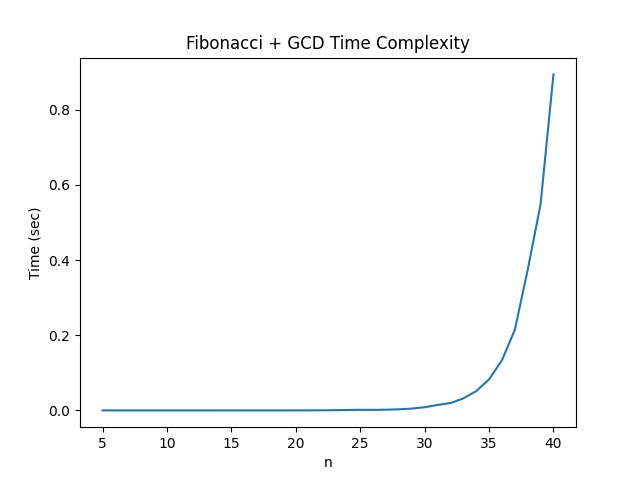

# GCD 알고리즘 및 피보나치 복잡도 분석

---

## 1. GCD 알고리즘

### (1) 알고리즘 설명
유클리드 호제법을 사용하여 최대공약수를 계산하였다.

### (2) 코드
```c
int gcd(int a, int b) {
    while (b != 0) {
        int temp = a % b;
        a = b;
        b = temp;
    }
    return a;
}
```c
## 실행 결과 그래프

n 값 증가에 따른 실행 시간 변화를 그래프로 나타내면 다음과 같다..


